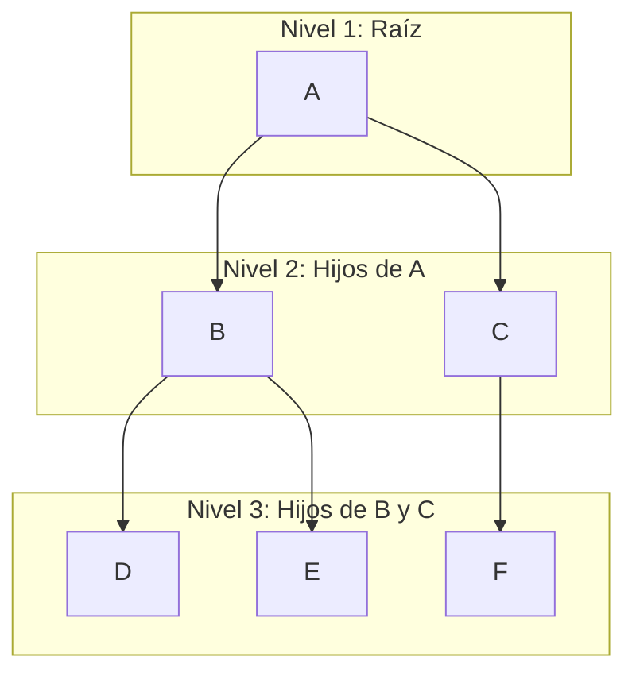

# GRAFOS
Un grafo es una estructura de datos compuesta por un conjunto de nodos (o vértices) y aristas (o enlaces) que conectan pares de nodos. Pueden ser dirigidos o no dirigidos, en función de si las aristas poseen o no una dirección. También pueden ser cíclicos o acíclicos, dependiendo de si contienen o no ciclos.

Algunos conceptos importantes:
- **Nodos:** Los puntos o vértices en el grafo.
- **Aristas:** Las conexiones o enlaces entre los nodos.
- **Ciclo:** Cadena donde el vértice final es el vértice inicial.

# ÁRBOLES
Un árbol (memoria interna) es una estructura no lineal, dinámica y homogénea  de datos que organiza sus elementos (nodos) formando jerarquías. Es así que cada nodo esta enlazado con el próximo, pero ya no por orden lineal, sino justamente siguiendo una jerarquía.

Los árboles ofrecen eficiencia en la búsqueda, especialmente en estructuras equilibradas donde la complejidad promedio es $$O(\log n)$$, además de facilitar la representación de datos jerárquicos y la manipulación de relaciones complejas. También permiten almacenar datos de forma ordenada, lo que agiliza el acceso y la manipulación. Su versatilidad los hace esenciales en diversas aplicaciones computacionales, como árboles de decisión, sistemas de archivos, procesamiento gráfico, bases de datos y compiladores.

En base a sus características:
- Todos los elementos son del mismo tipo de dato (homogénea).
- Tiene la posibilidad de cambiar su forma y cantidad de nodos durante tiempo de ejecución (dinámica).
- Cada elemento puede tener más de un sucesor (no lineal).
- Es una estructura totalmente **recursiva**, debido a que cada subárbol de un árbol es otro árbol, y la estructura se define de manera similar en cada nivel. Se definen y ejecutan recursivamente.
- Puede tener ```n``` cantidad de punteros internos.

> [!TIP]
> **¿Cuándo uso esta estructura?**
> - **Representar datos jerárquicos:** como estructuras que simulan relaciones padre-hijo. Ejemplos: sistemas de archivos, organigramas, árboles genealógicos.
> - **Almacenar datos para una búsqueda eficiente:** los árboles binarios de búsqueda (ABB) permiten búsquedas, inserciones y eliminaciones en tiempo logarítmico en el mejor de los casos.
> - **Representar listas ordenadas de datos:** los árboles equilibrados como AVL o árboles B-trees aseguran que los datos estén organizados y permitan accesos rápidos.
> - **Flujo de trabajo en composición de imágenes digitales:** por ejemplo, los árboles de decisión y estructuras jerárquicas ayudan en el modelado de imágenes y renderizado.
> - **Algoritmos de encaminamiento:** en redes informáticas, los árboles ayudan a calcular rutas eficientes para el envío de paquetes (como en árboles de expansión mínima).

## NODOS
Un nodo es un punto de la estructura que contiene un valor o dato y puede estar conectado a otros nodos.
- **Nodo Antecesor/Padre:** es el único antecesor directo de un nodo. Si X es antecesor de Y, además X apunta a Y decimos que X es el padre de Y.
- **Nodo Descendiente/Hijo:** es el descendiente directo de otro nodo (se ubica debajo de otro nodo), dependiendo así de otro nivel superior. Si X es descendiente de Y, además X es apuntado por Y decimos que X es el hijo de Y.
- **Nodo Raíz:** es el nodo superior, por lo que es el único sin padre, y representa la entidad mayor del árbol. Ningún nodo puede apuntar a él.
- **Nodo Terminal/Hoja:** es un nodo sin descendencia.
- **Nodo Interior:** es un nodo que no es raíz ni terminal. Es todo aquel nodo el cual tiene hijos y tiene padre.
- **Nodos Hermanos:** son dos nodos que comparten un mismo antecesor. Se denoniman hermano izquierdo o derecho respectivamente.

Es importante conocer los siguientes conceptos:
- **Grado (nodo):** es el número de descendientes directos de un determinado nodo.
- **Nivel/Profundidad** es la longitud de camino de la raíz a ese nodo.
- **Altura (nodo):** es la longitud del camino más largo de ese nodo a una hoja.

> [!TIP]
> **Como calcular la cantidad total de nodos de un árbol:**
> - **Fórmula para un árbol binario completo:** $$T(n) = 2^{n+1} - 1$$
> - **Fórmula general para un árbol de grado *g*:**$$T(n) = \frac{g^n - 1}{g - 1}$$

## PROPIEDADES
- **Grado (árbol):** es el número máximo de descendientes directos que tienen los nodos del árbol.
- **Arista/Rama:** es un camino desde el nodo raíz hasta una hoja.
- **Camino:** es una secuencia de nodos que están conectados dentro del árbol. Su longitud es el número de nodos que comparten este camino menos uno, o bien el número de aristas que los une.
- **Altura (árbol):** es el número máximo de niveles de todos los nodos del árbol.

### Amplitud/Anchura
La amplitud de un árbol es el número máximo de nodos que se encuentran en un solo nivel del árbol. Para calcular la amplitud de un árbol completo, es necesario conocer el grado máximo del árbol y la cantidad de niveles. Se asume que el árbol está completo, lo que significa que todos los niveles están llenos hasta el máximo, aunque a veces se añadan nodos "especiales" (como nodos nulos) para completar los niveles.

La fórmula para calcular el número máximo de nodos en un nivel específico \( n \) de un árbol completo es:

$$
A(n) = \text{grado}^{n-1}
$$

Donde:
- **grado** es el número máximo de hijos que un nodo puede tener (por ejemplo, en un árbol binario, el grado es 2).
- **n** es el nivel específico para el que se calcula la cantidad máxima de nodos.

En resumen, la anchura se calcula bajo la suposición de que el árbol está completo y tiene nodos hasta el máximo en cada nivel.

> [!NOTE]
> Con todo lo anterior mencionado, es probable que nos podamos encontrar con los siguientes casos cuando tratamos con árboles:
> - **Sub-Árbol:** conjunto formado por un nodo y todos sus descendientes.
> - **Árbol nulo:** es un árbol sin nodos, ni siquiera una raíz. Se representa con un puntero que apunta a ```null```, indicando que no hay ninguna estructura de árbol cargada. Esto es útil porque permite verificar si el árbol está vacío y evitar errores al intentar acceder a nodos inexistentes.
> - **Bosque:** es una colección/conjunto, normalmente ordenado, de dos o más árboles. En bases de datos, esto puede relacionarse con la representación de relaciones y jerarquías complejas. Por ejemplo, una base de datos puede tener múltiples índices que se representan como árboles separados, formando un bosque.

### EJEMPLO



`A` es la raíz. `B` y `C` son hijos de `A` (y por ende hermanos). `D` y `E` son hijos de `B` (hermanos). `F` es hijo de `C`. `D`, `E` y `F` son primos, al mismo tiempo de que son los nodos terminales del árbol (hojas).

> [!IMPORTANT]
> Los árboles son un tipo especial de grafos, pero a diferencia de estos, en un árbol cada elemento puede tener varios elementos posteriores, pero solamente puede tener un único elemento anterior.
