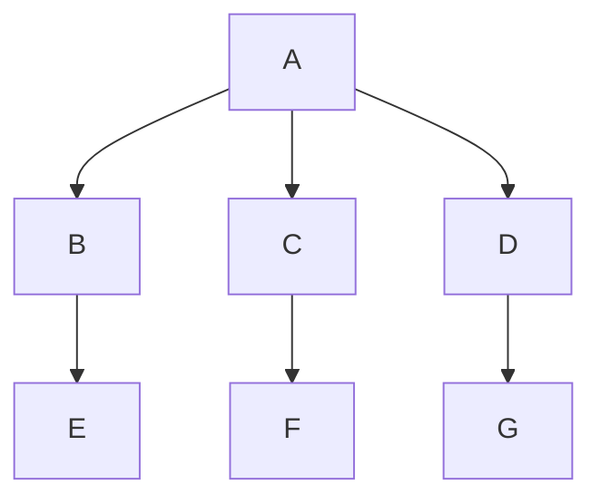
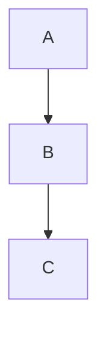
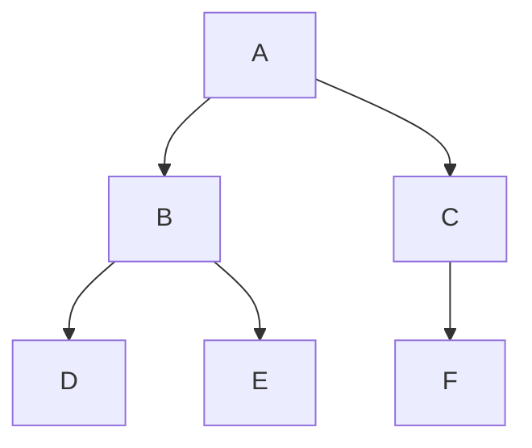
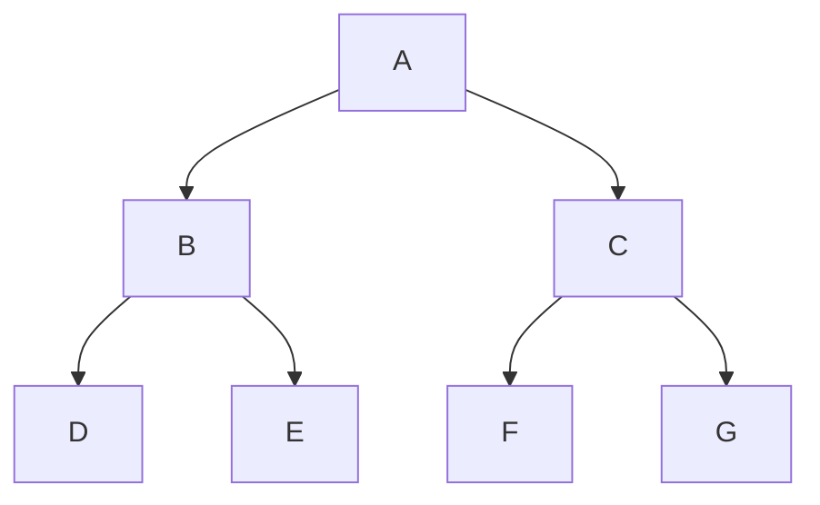
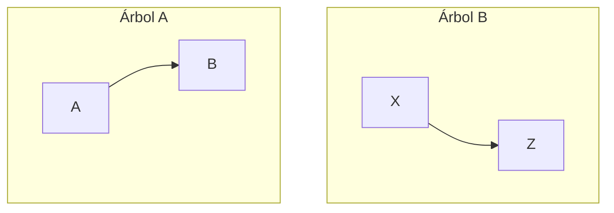
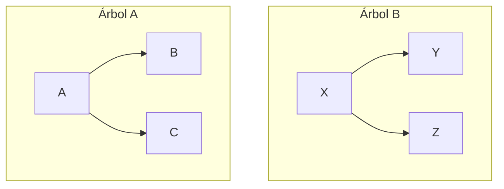
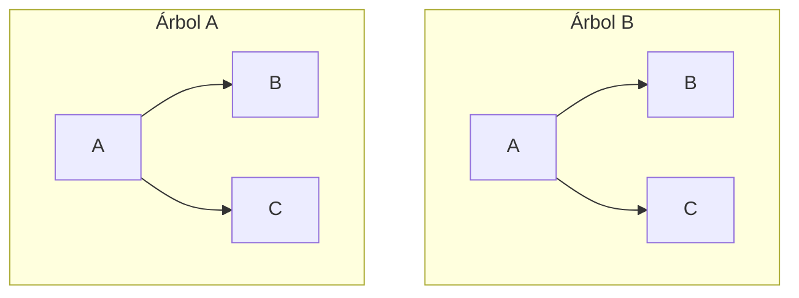

# ÁRBOLES N-ARIOS
Un árbol n-ario es una estructura en la que cada nodo puede tener un número arbitrario de subárboles, siempre que su grado sea mayor o igual a uno. Esto significa que cada nodo puede tener múltiples descendientes directos, organizados en subárboles. De todos modos, a los árboles cuyo grado no es dos, se los termina convirtiendo en binarios para su manejo.

Por ejemplo, un árbol **ternario** es aquel en donde cada nodo puede tener hasta tres hijos. En lugar de solo los subárboles izquierdo y derecho, un árbol ternario incluye un tercer subárbol, llamado "medio".



Por otro lado, un árbol **unario** es un caso especial en el que cada nodo tiene como máximo un único descendiente directo. Esto hace que su estructura se asemeje a una lista simplemente enlazada, ya que cada nodo apunta solo al siguiente nodo en la secuencia, sin retroceder al anterior. Lo que sucede en este caso es que un puntero apunta a ```null```, resultando en un solo descendiente directo. 

Por ejemplo, va a tener un hijo en el sub-árbol derecho, y en el izquierdo va a apuntar a ```null```, y así sucesivamente, variando cual apunta a un hijo o no, hasta el nodo terminal.


# ÁRBOLES BINARIOS
En grafos se define al árbol binario como un grafo conexo, acíclico y no dirigido en el cual el grado máximo de cada vertice es dos. Es decir, es un árbol de grado dos y está formado por nodos cuyos sub-árboles "izquierdo" y "derecho" son a su vez árboles binarios. 

### DECLARACIÓN
```js
prim: puntero a nodo
nodo = Registro
      campo_informacion: tipo_dato
      izquierda; derecha: puntero a nodo
FinRegistro
```

Se dice que está **equilibrado** si cada nodo tiene exactamente dos hojas o ninguna, y si cada una está al mismo nivel. Es decir, si se verifica que:

<div align="center"> 

$|\text{altura(sub-árbol izquierdo)} - \text{altura(sub-árbol derecho)|}\leq 1$

</div>



Por otra parte, está completo si todos los nodos tienen dos descendientes directos, y si todos los nodos terminales comparten el mismo nivel. De este modo, cada nodo tiene el máximo de descendientes que puede tener, haciendolo eficiente en términos de espacio y permitiendo una buena performance en operaciones como búsqueda, inserción y eliminación.



Además de lo ya mencionado, existen varios tipos de árbol binario:
### DISTINTOS
Dos árboles binarios son distintos cuando tienen estructuras diferentes, es decir, la disposición de los nodos y las conexiones entre ellos varían.


> [!TIP]
> Pasos para verificar si dos árboles son identicos:
> 1. Caso base: Si ambos árboles están vacíos, son idénticos. Si uno está vacío y el otro no, no son idénticos (fallo de estructura).
> 2. Comparando los valores en las raíces:
>     - Si los valores coinciden:
>        1. Verifica recursivamente si los subárboles izquierdos son idénticos.
>        2. Verifica recursivamente si los subárboles derechos son idénticos.
>    - Si los valores difieren, no son idénticos.
> El proceso atraviesa ambos árboles simultáneamente y compara tanto la estructura como los valores de los nodos.

### SIMILARES
Dos árboles binarios son similares cuando tienen estructuras idénticas, pero la información que contienen sus nodos es diferente. La disposición de los nodos es la misma, pero el contenido de cada nodo varía.

### EQUIVALENTES
Dos árboles binarios son equivalentes cuando son similares en estructura y además los nodos contienen la misma información. Esto significa que tanto la disposición como el contenido de los nodos es la misma.

