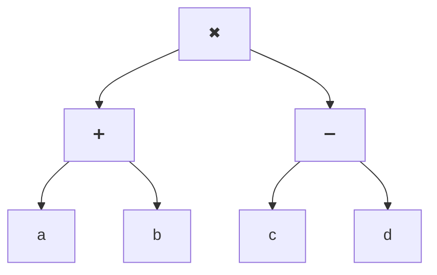
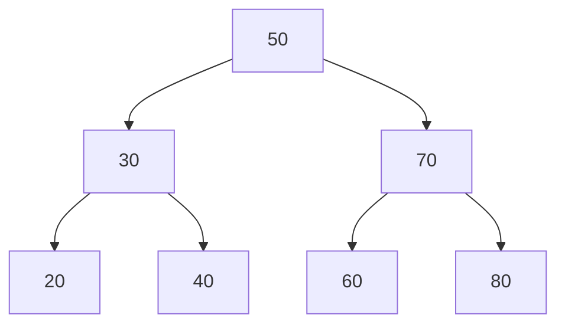
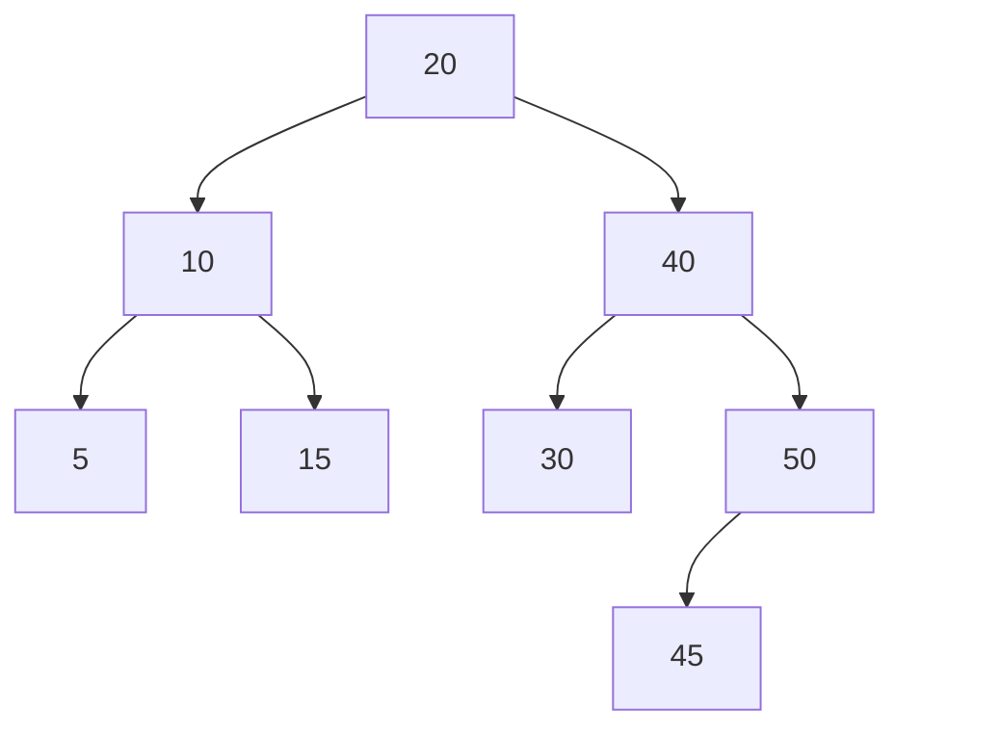

# ÁRBOLES BINARIOS DE EXPRESIÓN
Son aquellos árboles binarios donde las hojas representan operandos, como constantes o nombres de variables, mientras que los nodos internos contienen operadores. Este tipo de árbol es específicamente binario porque todas las operaciones que representa son binarias. Su propósito principal es representar y evaluar operaciones matemáticas, donde el nodo raíz es generalmente el operador, y los nodos hijos son los operandos o subexpresiones.

> [!NOTE]
>  Aunque un nodo generalmente tiene dos hijos, en ciertos casos un nodo puede tener solo un hijo si el operador es unario.
Por ejemplo si tenemos ```(a + b) * (c - d)```:


Se puede recorrer de tres formas:
- **Infija (In Order):** permite visualizar la expresión en su forma original sin los separadores explícitos entre operadores y operandos. Es decir: ```[a] [+] [b] [*] [c] [-] [d]```.
- **Prefija (Pre Order):** muestra la expresión priorizando los operadores, colocando el operador antes de sus operandos. Es decir: ```[*] [+] [a] [b] [-] [c] [d] ```.
- **Posfija (Post Order):** pioriza los operandos, colocando el operador después de todos sus operandos. Es decir: ```[a] [b] [+] [c] [d] [-] [*]```.

# ÁRBOLES BINARIOS DE BÚSQUEDA (ABB)
Se distinguen porque para cada nodo en el árbol, el valor de cualquier nodo en su subárbol izquierdo es menor que el valor del nodo padre, mientras que el valor de cualquier nodo en su subárbol derecho es mayor. Esta organización permite que las operaciones de búsqueda, inserción y eliminación se realicen de manera eficiente, aprovechando la estructura ordenada del árbol.
En resumen, en cualquier nodo, se cumple que:

$$
\text{sub-árbol izquierda} < \text{raíz} < \text{sub-árbol derecha}
$$



Esta organización permite que, al recorrer el árbol en orden, se obtenga una lista de valores ordenados, similar al resultado de ciertos métodos de ordenación como el Quicksort. La búsqueda en un ABB se realiza comparando el valor buscado con el valor del nodo raíz y descendiendo al subárbol izquierdo o derecho según corresponda, lo que resulta en una búsqueda eficiente.

> [!IMPORTANT]
> Es crucial recordar que en cualquier nodo todos los valores del subárbol izquierdo del nodo son menores o iguales al valor del nodo. De modo similar, todos los valores del subárbol derecho deben ser mayores que los valores del nodo.

Para construir un ABB:
- El primer elemento que se inserta en el árbol se convierte en el nodo raíz.
- Se comienza en la raíz y se compara el valor del nuevo elemento con el valor del nodo actual. Si el valor del nuevo elemento es menor o igual al valor del nodo actual, se dirige al sub-árbol izquierdo. Si es mayor, se dirige al sub-árbol derecho.
- Este proceso se repite de manera recursiva en el subárbol correspondiente hasta encontrar un nodo NULL, que indica el lugar donde se debe insertar el nuevo elemento como un nuevo nodo.

> [!WARNING]
> + Un ABB no balanceado se convierte en una estructura degenerada cuando los elementos se insertan de forma secuencial, es decir, en orden creciente o decreciente. En este caso, el árbol pierde su forma de árbol binario equilibrado, convirtiéndose en una "cadena" de nodos conectados solo por un solo lado (todos los nodos tienen solo un hijo, ya sea izquierdo o derecho). Esto, como vimos antes, simula una lista lineal.
> + En este escenario, cada nodo tiene solo un hijo, lo que da como resultado una estructura similar a una lista enlazada. Si bien sigue siendo un árbol binario, sus características de búsqueda y rendimiento se asemejan más a las de una lista debido a su falta de balance. Las operaciones de búsqueda y manipulación de nodos en un árbol degenerado se vuelven lineales, lo que genera un rendimiento muy similar al de una lista.

# ÁRBOLES BINARIOS AVL
Es un tipo de árbol binario de búsqueda que mantiene una propiedad especial para garantizar su equilibrio, donde su principal característica es que la diferencia entre las alturas de los sub-árboles izquierdo y derecho de cada nodo es, como máximo, uno. Esta propiedad es conocida como **balanceo** y asegura que el árbol permanezca equilibrado, lo que optimiza las operaciones de búsqueda, inserción y eliminación. "AVL" proviene de "Adelson-Velsky and Landis", los creadores de este árbol.

El **factor de equilibrio** de un nodo se define como la diferencia entre las alturas entre los sub-árboles derecho e izquierdo. Para que un árbol sea considerado un AVL, el factor de equilibrio de cada nodo debe ser uno de los siguientes valores:
- Factor de equilibrio = 0: El nodo está equilibrado, los sub-árboles izquierdo y derecho tienen la misma altura.
- Factor de equilibrio = 1: El nodo está desequilibrado, el sub-árbol derecho es un nivel más alto que el sub-árbol izquierdo.
- Factor de equilibrio= -1: El nodo está desequilibrado, el sub-árbol izquierdo es un nivel más alto que el sub-árbol derecho.

$$
FE = H(T_d) - H(T_i)
$$

$$
-1 \leq \text{FE} \leq 1
$$

> [!NOTE]
> Un ABB puede llegar a desbalancearse si no se manejan adecuadamente las inserciones y eliminaciones, lo que puede hacer que su altura sea de $$O(n)$$ en el peor caso (por ejemplo, si se inserta en orden creciente). Los AVL están diseñados específicamente para mantenerse balanceados, lo que garantiza una mejor eficiencia de operación, ya que siempre se mantiene un equilibrio estricto, y, por esto, son los preferidos en casos donde se necesita mantener un balance estricto para evitar que la estructura se desbalancee y que la búsqueda se vuelva ineficiente.

Cuando el factor de equilibrio de un nodo se encuentra fuera de este rango (es decir, mayor que 1 o menor que -1), el árbol está desbalanceado y necesita ser reequilibrado. Para restaurar el equilibrio después de una inserción o eliminación, se deben realizar rotaciones en el árbol. Estas rotaciones ajustan la estructura del árbol para que cumpla nuevamente con la propiedad de equilibrio. 

Un ejemplo de árbol AVL:


En resumen, un árbol no vacío es AVL si y solo si:
- Su subárbol izquierdo es AVL.
- Su subárbol derecho es AVL.
- La diferencia en altura entre el sub-árbol izquierdo y el sub-árbol derecho es a lo sumo 1.

> [!IMPORTANT]
> En caso de solo cumplir la última condición sobre la diferencia de alturas, el árbol recibe el nombre de **Árbol Balanceado Formalmente**.
