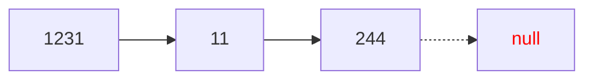

# TIPOS DE CARGA

## CARGA APILADA
Se basa en el concepto de pila (LIFO), con el puntero externo siempre apuntando al último dato cargado. Es rápida pero riesgosa, ya que una manipulación incorrecta del puntero puede llevar a perder la estructura completa. Básicamente, se recupera de forma inversa.
```go
Mientras (condicion) Hacer
	Nuevo(q)
	// Condición para obtener el valor
	*q.dato:= valor
	*q.proximo:= primero
	primero:= q
	// Avanzar
FinMientras
```
Por ejemplo, si se quiere cargar una secuencia a una lista:
#### SECUENCIA
<table align="center">
  <tr>
    <td>1231</td>
    <td>11</td>
    <td>244</td>
  </tr>
</table>

#### LISTA




```js
ACCION carga_apilada() ES
AMBIENTE
	nodo = registro
	dato: entero
	proximo: puntero a nodo
	FinRegistro
	prim; p: puntero a nodo
	sec: secuencia de enteros; ven: entero
PROCESO
	Arrancar(sec); Avanzar(sec, ven)
	primero:= null
	Mientras (NFDS(sec)) Hacer
	Nuevo(p)
	*p.dato:= ven
	*p.proximo:= primero
	primero:= p
	Avanzar(sec, ven)
	FinMientras
FINACCION
```

## CARGA ENCOLADA
Sigue la filosofía de las colas (FIFO), lo que la hace más segura porque solo se modifica el puntero externo una vez al comienzo. Sin embargo, es más lenta debido a los ajustes necesarios en los punteros para cada nueva inserción.
```go
Mientras (condicion) Hacer
	Nuevo(q)
	// Condición para obtener el valor
	*q.dato:= valor
	*p.proximo:= null
	Si (primero = null) Entonces
		primero:= q
	Sino
		*auxiliar.proximo:= p
	FinSi
	auxiliar:= q
FinMientras
```
Tomando el mismo ejemplo anterior:
```js
ACCION carga_encolada() ES
AMBIENTE
	nodo = registro
	  dato: entero
	  proximo: puntero a nodo
	FinRegistro
	prim; p; q: puntero a nodo
	sec: secuencia de enteros; ven: entero
PROCESO
	Arrancar(sec); Avanzar(sec, ven)
	primero:= null; q:= null
	Mientras (NFDS(sec)) Hacer
	  Nuevo(p)
	  *p.dato:= ven
	  *p.proximo:= null
	  Si (primero = null) Entonces
		*p.proximo:= primero
		primero:= p
	  Sino
		*q.proximo:= p
	  FinSi
	  *p.proximo:= null
	  q:= p
	  Avanzar(sec, ven)
	FinMientras
FINACCION
```

## CARGA ORDENADA
Este método es el más lento, pero ideal para listas que se utilizarán frecuentemente en interacciones con usuarios. Una vez que se realiza la carga, mejora significativamente la eficiencia de las búsquedas.

Tomando el mismo ejemplo ya mencionado:
```js
ACCION carga_ordenada() ES
AMBIENTE
	nodo = registro
	  dato: entero
	  proximo: puntero a nodo
	FinRegistro
	prim; p; q; a: puntero a nodo
	sec: secuencia de enteros; ven: entero
PROCESO
	Arrancar(sec); Avanzar(sec, ven)
	primero:= null; q:= null
	Mientras (NFDS(sec)) Hacer
	  Nuevo(p)
	  *p.dato:= ven
	  q:= primero
	  Mientras ((q <> null) ^ (*q.dato < ven)) Hacer
		a:= q
		q:= *q.proximo
	  FinMientras
	  Si (a = null) Entonces
		*p.proximo:= primero
		primero:= p
	  Sino
		*p.proximo:= q
		*a.proximo:= p
	  FinSi
	  Avanzar(sec, ven)
	FinMientras
FINACCION
```

> [!TIP]
> ¿En que casos **NO** conviene realizar una carga ordenada? Por lo general:
> 
> + Si no hay un usuario interactuando, alcanza con hacer carga apilada o encolada, siendo la primer opción la más sencilla de implementar.
> + Si no se va a realizar una búsqueda, tampoco tiene sentido realizar una carga ordenada.
